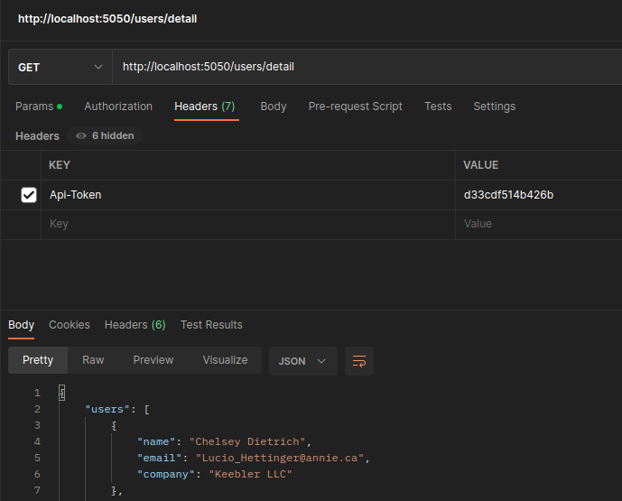

# Desafio Python #Sangue-Laranja 🍊

O objetivo desse desafio é avaliar o conhecimento dos candidatos.  Não existe resolução certa ou errada, avaliaremos com o nível de experiência que for exigido pelas vagas disponíveis no momento. Envie o seu desafio mesmo que você não conclua todas as questões, avaliaremos tudo o que for enviado.


## Developer challenge


Sua tarefa é fazer uma aplicação que carregue a saida da URL https://jsonplaceholder.typicode.com/users , que retorna uma lista de usuário em JSON.

Faça um programa que carregue a saída dessa URL e mostre os seguintes dados:
    
- Os websites de todos os usuários

        GET /users/websites
        {
            "websites": [
                {
                    "website": "hildegard.org"
                },
                ...
                {
                    "website": "ambrose.net"
                }
            ]
        }


- O Nome, email e a empresa em que trabalha (em ordem alfabética)

        GET /users/detail
        {
            "users": [
                {
                    "name": "Chelsey Dietrich",
                    "email": "Lucio_Hettinger@annie.ca",
                    "company": "Keebler LLC"
                },
                ...
                {
                    "name": "Patricia Lebsack",
                    "email": "Julianne.OConner@kory.org",
                    "company": "Robel-Corkery"
                }
            ]
        }


- Mostrar todos os usuarios que contenham determinado texto no nome.

        GET /users?name=Graham
        {
            "users": [
                {
                    "id": 1,
                    "name": "Leanne Graham"
                }
            ]
        }
    

EXTRA: 
1. Criar teste unitário para validar os itens a cima.
2. Adicionar validação via Authorization Header para acessar o recurso(Pode ser um token fixo, definido em uma variavel).


## Resposta: Augusto

- challenge: Todas as requisições (`api_user/app.py`) foram desenvolvida. Carreguei a saida da URL https://jsonplaceholder.typicode.com/users via Postman, confome requisição exemplo abaixo, que também foi desenvolvida. 

        POST /users
        [
            ....
            {
                "id": 11,
                "name": "Davi Arraes",
                "username": "Moriah.Stanton",
                "email": "Rey.Padberg@karina.biz",
                "address": {
                "street": "Kattie Turnpike",
                "suite": "Suite 198",
                "city": "Fortaleza",
                "zipcode": "31428-2261",
                "geo": {
                    "lat": "-38.2386",
                    "lng": "57.2232"
                }
                },
                "phone": "024-648-3804",
                "website": "lego.com",
                "company": {
                "name": "Hoeger LLC",
                "catchPhrase": "Centralized empowering task-force",
                "bs": "target end-to-end models"
                }
            },
            ....
        ]

- Apenas na terceira requisição, a chamada alterei para `/user/name/Graham`.
- EXTRA: 2º Eu fiz, Ver 1. Configurações abaixo.
- Bonus: Dockerfile para container.

O app foi desenvolvido em Python 3.8 usando o framework Flask (para APIs e microsserviços em Python).

1. ### Configurações
Em `db` está o arquivo para subir seu banco de dados Postgres (o ideal seria usar migrations, infelizmente não deu tempo).
Em `api_users` configurar o arquivo `conf.py` com a suas configurações locais do banco Postgres. 
Nesse mesmo arquivo também está o `kEY_VALUE` para setar no Hearder da requisição HTTP, no Postman, conforme imagem abaixo.



2. ### Para executar localmente
Uma vez configurado o Banco e carregado JSON da saida da URL https://jsonplaceholder.typicode.com/users, usando a requisita POST `/users` via Postman, basta start a app:

```bash
python app.py
```
Assim, com um Postman, por exemplo, já pode testar as requisições.


3. ### (Bonus) Executando com Docker
```bash
# Bd Postgres. [É necessário subir o banco.]
docker run --add-host=host.docker.internal:172.17.0.1 --name lab.postgres -e PGDATA=postgres -e POSTGRES_PASSWORD=sua_senha -p 5432:5432 -i -d postgres:13.8-alpine
 
# App
# Mudar em `api_users/conf.py`: 'host': 'host.docker.internal',
docker build -t fcamara.nilohealth:0.1 .
docker run --name fcamara.nilohealth --add-host=host.docker.internal:172.17.0.1 -p 5050:5050 -d fcamara.nilohealth:0.1
```